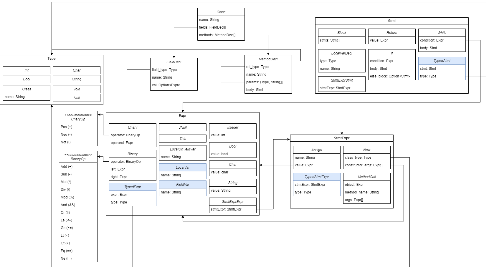

## Parser

Geschrieben von: Tori Gönnheimer, Sander Stella

Ausfürhliche Mithilfe (v.a. beim Schreiben der Grammatik): Val Richter

Der Parser akzeptiert den Text eines Java Programs und gibt einen Abstract Syntax Tree (AST) zurück.
Dafür wird die Libray [pest.rs](https://pest.rs/) verwendet, um das Inital parsing durchzufüren.
Für dieses inital parsing nutzt pest unsere vorher definiete Gramatik.

Die Grammatik hat sich Anfangs an den Hilfsmitteln der Vorlesung orientiert. Später wurde diese allerdings neu geschrieben, um sich stärker am verwendeten AST zu orientieren. Dadurch wurde auch die Implementation des restlichen Parsers sehr viel erleichtert.
Das Ergebnis, welches Pest zurückgibt, wird .
Dabei wird wie folgt vorgegangenen:

-   Eine funktion schaut sich die aktuelle regel an
-   Es wird der entsprechende code zu dieser regelausgefür
-   Sofern subregeln in dieser regel vorkommen wird die entsprechende funktion aufgerufen

## Typechecker

Geschrieben von: Maximilian Floto und Philipp Wolf im Pair Programming

Der Typechecker akzeptiert einen Abstract Syntax Tree (AST) und gibt einen getypten AST (TAST) zurück.
Er führt eine umfassende Analyse durch, um die Typen aller Variablen und Ausdrücke im Code zu bestimmen.
Er stellt sicher, dass jede Variable vor ihrer Verwendung korrekt deklariert und initialisiert wurde, wodurch potenzielle Fehler in der Anwendung vermieden werden.
Er bestimmt die Typen aller Ausdrücke und Variablen und überprüft, ob alle Variablen vor ihrer Verwendung korrekt deklariert und initialisiert wurden.

Funktionsweise des Typecheckers:
Der Typechecker iteriert über alle übergebenen Klassen und prüft auf mehrfache Klassendeklarationen. Die Felddeklarationen werden in einem neuen getypten Klassenobjekt gespeichert, in dem alle weiteren getypten Methoden und deren Statements gespeichert werden. Anschließend iteriert der Typechecker über alle Methoden und prüft auf mehrfache Methodendeklarationen und typisiert die Methodenparameter. Nachdem alle Statements typisiert wurden, wird der Rückgabetyp der Methode geprüft und die Methode im getypten Klassenobjekt gespeichert. Nach dem Überprüfen und Typisieren der Klasse wird diese in einen Vektor an getypten Klassen gespeichert. Nachdem alle Klassen getypt wurden, wird der Vektor an getypten Klassen zurückgegeben.

Folgende Funktionen werden vom Typechecker übernommen:

-   Liest alle definierten Types/Strukturen
-   Typisierung aller Variablen und Ausdrücke
-   Checken von mehreren Klassen
-   Checken der Rückgabe-Typen von Methoden
-   Ersetzen von LocalOrFieldVar durch LocalVar oder FieldVar

Folgende Fehler werden vom Typechecker erkannt:

-   Mehrfache Deklaration einer Klasse
-   Mehrfache Deklaration einer Methode
-   Type-Mismatch bei Methodenrückgabe
-   Type-Mismatch bei Methodenaufruf
-   Type-Mismatch bei Methodenparametern
-   Type-Mismatch bei FieldDecl
-   Type-Mismatch bei Unary/Binary-Operationen
-   Mehrfache Deklaration von FieldDecl
-   Mehrfache Deklaration von LocalOrFieldVar
-   Nicht deklarierte Variable
-   Unbekannte Methode bei Methodenaufruf
-   Verwendung einer nicht deklarierten Variable
-   Panic bei TypedExpr in AST
-   Bedingung von If/While-Statement ist kein Bool

## Codegenerierung

Definition DIR(Duck Intermediate Representation), ConstantPool, LocalVarPool, Methoden zur Generierung der DIR-Instructions, BugFixes, etwas ByteCode-Umwandlung: Marion Hinkel und Benedikt Brandmaier im Pair Programming

ByteCode-Umwandlung, Bugfixes, StackSize, StackMapTable und ausführliche Mithilfe: Val Richter

Zur Bytecode-Generierung wird der Typed Abstract Syntax Tree (TAST) in Java Bytecode umgewandelt.
Es wurden keine Libraries (wie z.B. [ASM](https://asm.ow2.io/javadoc/)) verwendet.
Für die Codegenerierung wird eine Intermediate Representation (IR) genutzt, die eine Class-ähnliche Struktur
(mit Konstantenpool, LocalVarpool, Methoden mit Code als Instruktionen, etc.) besitzt.
Diese IR wird dann komplett manuell in Java Bytecode übersetzt. Dies hat dem Code-gen Team sehr viel Zeit gekostet,
da z.B. die Stack-Size, der Konstantenpool, LocalVarPool und alle Jumps manuell berechnet werden mussten.

Zudem hatten wir zeitweise eigene Instructions für relative Jumps implementiert, die wir dann in absolute Jumps umgerechnet haben,
da wir dachten, dass die JVM keine relativen Jumps unterstützt. Dieser Glauben kam daher, dass die Ausgabe von `javap` die
Ziel-Adressen von Jumps immer als absolute Adressen angezeigt hat. Es stellte sich dann aber heraus, dass die JVM eigentlich
nur relative Jumps versteht und nur javap diese schon umgerechnet dargestellt hat. Aber selbst danch waren die relativen Jumps
noch sehr fehleranfällig und hatten häufig off-by-one Errors.

Zudem musste eine [StackMapTable](https://docs.oracle.com/javase/specs/jvms/se20/html/jvms-4.html#jvms-4.7.4) per Hand implementiert werden,
da die JVM unsere Klassen sonst nicht geladen hat. Die Implementation dieser war ebenfalls sehr zeitaufwendig, da an sich ein ganzer
Typchecker für den generierten Bytecode implementiert werden musste, um korrekte StackMapTables zu generieren.

Das Troubleshooten von Testfehlern war auch sehr aufwendig da oft javap gar nicht erst den Fehler im Klassencode ausgab
und wir mit einem Hex-Editor die Klassen von Hand analysieren mussten, da es auch kein anderes Tool gab, um solche Fehler
auszugeben und die Zeit fehlte ein eigenes Tool dafür zu schreiben.

Da es auch keine gute Dokumentation gibt, die in etwa zeigt, welcher Bytecode für welche Operationen genutzt wird, mussten wir
uns die Bytecode-Spezifikationen anschauen und sehr viel mit Tools wie javap und [godbolt](https://godbolt.org/) arbeiten
(wir haben auch https://docs.oracle.com/javase/specs/jvms/se20/html/jvms-3.html genutzt, aber diese Dokumentation nutzt
sehr spezifische Instruktionen und wurde deswegen selten genutzt) in die wir manuell Java Code eingeben konnten, um zu sehen,
welcher Bytecode bei verschiedenen Operationskombinationen generiert wird, was sehr zeitaufwendig war.

## Testing

Jeder Test besteht aus einer Java-Klasse (liegt jeweils in `lib/testcases`) und aus dem dazugehörigen getypten AST, welcher für jeden Test per Hand geschrieben wurde. Mit diesen beiden Teilen testen wir dann den Parser, Typchecker und die Codegenerierung. Außerdem testen wir auch, dass der handgeschriebene TAST korrekt ist. Wie diese Tests funktionieren, wird im Folgenden ausgeführt.

Um zu testen, dass die handgeschriebenen TASTs korrekt sind, wird aus dem TAST ein syntaktisch korrektes Java-Programm geschrieben. Alle Typinformationen des TAST werden dabei ignoriert.
Das so erstellte Java-Programm wird dann in eine Datei geschrieben und mit `javac` kompiliert. Daraufhin wird überprüft, dass die kompilierte `.class`-Datei identisch mit der `.class`-Datei ist,
die man beim Kompilieren des originalen Java-Programms erhält. Eine nervige Besonderheit bei diesem Vorgehen ist, dass der vom AST generierte Java-Code die originale Java-Datei überschreiben muss,
da der `javac` Compiler sonst minimal unterschiedliche `.class`-Dateien schreibt. Trotzdem war dieser Test sehr hilfreich, da beim handschriftlichen Schreiben der teilweise sehr großen TASTs,
sehr oft kleine Fehler gemacht wurden, die ansonsten nur schwer zu finden wären.

Außerdem schreiben wir bei dem Test des TASTs den erwarteten AST und TAST als `.json`-Dateien in den `lib/testcases` Ordner. Diese Dateien dienen vor allen bei der Implementation der anderen Teile des Compilers, da somit leicht sichtbar ist, wie der erwartete AST bzw. TAST aussehen sollten für den jeweiligen Test.

Das Testen des Parsers war relativ leicht. Hier musste nur die jeweilige Java-Datei gelesen und in den Parser gegeben werden. Sobald dieser dann den erstellten AST zurück gibt, kann überprüft werden, ob er identisch mit dem handgeschriebenen TAST ist. Dabei werden alle Typinformationen vom TAST vorher entfernt (wodurch wir den AST erhalten), weil der Parser ja noch keine Typinformationen hinzufügt.

Das Testen des Typcheckers läuft ähnlich ab. Der handgeschriebene TAST dient als erwartete Ausgabe des Typcheckers. Der AST, der als Eingabe für den Typchecker dient, wird über Entfernen der Typinformationen beim TAST generiert.

Das Testen des Codegens war dagegen sehr viel aufwendiger. Die Eingabe für die Codegenerierung ist mit den handgeschriebenen TASTs bereits gegeben. Um die Ausgabe zu überprüfen, hätte man allerdings die erwarteten Bytes per Hand aufschreiben müssen. Das wäre zu aufwendig und fehleranfällig gewesen. Stattdessen testen wir, dass die von uns geschriebene `.class`-Datei sich identisch mit der von `javac` erstellten `.class`-Datei verhält.

Dafür wurde zuerst die originale Java-Datei kompiliert. Zusätzlich wird eine Test-Datei geschrieben, welche eine `main` Funktion hat und alle Methoden der originalen Java-Datei aufruft. Über die handgeschriebenen TASTs wissen wir, welche Methoden die Klasse besitzt und welche Eingaben sie erwartet und was sie ausgibt. Die Eingaben werden pseudo-zufällig für den Test generiert. Falls die Methoden einen Wert ausgibt, schreibt die `main` Funktion der Test-Datei diesen Ausgabewert in die Konsole. Damit erhalten wir das erwartete Verhalten der originalen Java-Klasse.

Im nächsten Schritt überschreiben wir nun die `.class`-Datei der originalen Java-Datei mit den Bytes, die wir aus der Codegenerierung erhalten. Dann können wir Test-Datei nochmal ausführen. Diesmal versucht java aber natürlich die von uns geschriebene `.class`-Datei zu lesen und zu benutzen. Wenn die Test-klasse dann die selben Ausgaben macht, wissen wir, dass sich unsere `.class`-Datei genauso wie die originale `.class`-Datei verhält und unsere Codegenerierung entsprechend richtig funktioniert.

Zusätzlich nutzen wir in diesem Test auch das mit Java mitgelieferte Tool `javap`, welches uns erlaubt den originalen und den von uns generierten Bytecode zu disassemblieren. Wir schreiben die Ausgabe von `javap` dann in jeweils eine Datei (eine Datei für die originale von `javac` kompilierte Klasse und eine Datei für die von uns kompilierte Klasse). Diese Ausgaben sind zwar für den Test nicht notwendig, haben aber sehr geholfen bei Fehlersuche und Fehlerbehebung.

## Supported types

Unterstützte Typen sind in [Types](../lib/src/types.rs) definiert.
Mögliche Kombinationen sind den [Tests](../lib/testcases) zu entnehmen.

## AST-Definition

Die genaue Definition des ASTs, die verwendet wurde, ist in [AST-Klassendiagramm](./AST-Klassendiagramm.png) als UML-Diagramm dargestellt. Zusätzlich lassen sich in [hier](./Notizen%20zum%20AST.md) einige Erklärungen zum Diagramm finden.

